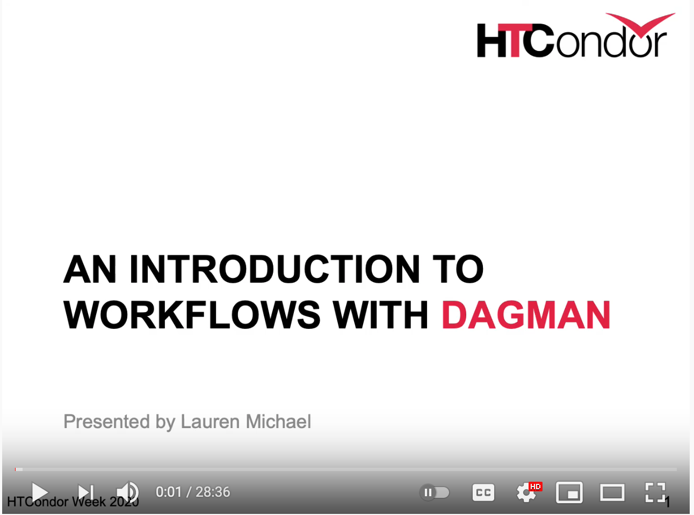

---
highlighter: none
layout: guide
title: "Overview: Submit Workflows with HTCondor's DAGMan"
guide:
    category:  Workflows
    tag:
        - htc
--- 

If your work requires jobs that run in a particular sequence, you may benefit from a workflow tool that submits and monitors jobs for you in the correct order. A simple workflow manager that integrates with HTCondor is DAGMan, or “DAG Manager” where DAG stands for the typical picture of a workflow, a directed acyclic graph.



* [Introduction](#introduction)
* [What is DAGMan?](#what-is-dagman)
* [The Basics of the DAG Input File](#the-basics-of-the-dag-input-file)
* [Running a DAG Workflow](#running-a-dag-workflow)
* [DAGMan Features](#dagman-features)
* [More Resources](#more-resources)




## Introduction

If your work requires jobs that run in a particular sequence, you may benefit 
from a workflow tool that submits and monitors jobs for you in the correct 
order. HTCondor has a built in utility called "DAGMan" that automates the
job submission of such a workflow.

This talk (originally presented at HTCondor Week 2020) gives a good introduction
to DAGMan and its most useful features: 

<a href="https://www.youtube.com/watch?v=1MvVHxRs7iU">

</a>

DAGMan can be a powerful tool for creating large and complex HTCondor workflows. 

## What is DAGMan?

DAGMan is short for "DAG Manager", and is a utility built into HTCondor for automatically running a workflow (DAG) of jobs, 
where the results of an earlier job are required for running a later job. 
This workflow is similar to a flowchart with a definite beginning and ending. 
More specificially, "DAG" is an acronym for [Directed Acyclic Graph](https://en.wikipedia.org/wiki/Directed_acyclic_graph), a concept from the mathematic field of graph theory:

1. Graph: a collection of points ("nodes" or "vertices") connected to each other by lines ("edges").
2. Directed: the edges between nodes have direction, that is, each edge begins on one node and ends on a different node.
3. Acyclic: the graph does not have a cycle - or loop - where the graph returns to a previous node.

By using a directed acyclic graph, we can guarantee that the workflow has a defined 'start' and 'end'. 
In DAGMan, each node in the workflow corresponds to a job submission (i.e., `condor_submit`).
Each edge in the workflow corresponds to a set of files that are the output of one job submission and 
the input of another job submission.
For convenience, we refer to such a workflow and the files necessary to execute it as "the DAG".

## The Basics of the DAG Input File

The purpose of the DAG input file (typically `.dag`) is to instruct DAGMan on the structure of the workflow you want to run. 
Additional instructions can be included in the DAG input file about how to manage the job submissions, rerun jobs (nodes), 
or to run pre- or post-processing scripts.

In general, the structure of the `.dag` input file consists of one instruction per line, with each line starting with a keyword defining the type of instruction. 

### 1. Defining the DAG jobs

To define a DAG job, we begin a new line with `JOB` then provide the name, the submit file, and any additional options. The syntax is

```
JOB JobName JobSubmitFile [additional options]
```
{:.file}

where you need to replace `JobName` with the name you would like the DAG job to have, and `JobSubmitFile` with the name or path of the corresponding submit file. Both `JobName` and `JobSubmitFile` need to be specified.

**Every node in your workflow must have a `JOB` entry in the `.dag` input file.** While there are other instructions that can reference a particular node, they will only work if the node in question has a corresponding `JOB` entry. 

### 2. Defining the connections

To define the relationship between DAG jobs in a workflow, we begin a new line with `PARENT` then the name of the first DAG job, followed by `CHILD` and the name of the second DAG job. That is, the `PARENT` DAG job must complete successfully before DAGMan will submit the `CHILD` DAG job. In fact, you can define such relationship for many DAG jobs (nodes) at the same time. Thus, the syntax is

```
PARENT p1 [p2 ...] CHILD c1 [c2 ...]
```
{:.file}

where you replace `p#` with the `JobName` for each parent DAG job, and `c#` with the `JobName` for each child DAG job. The child DAG jobs will only be submitted if all of the parent DAG jobs are completed successfully. Each `JobName` you provide must have a corresponding `JOB` entry elsewhere in the `.dag` input file.

> Technically, DAGMan does not require that each DAG job in a workflow is connected to another DAG job.
> This allows you to submit many unrelated DAG jobs at one time using DAGMan.

Note that in defining the `PARENT`-`CHILD` relationship, there is no definition of *how* they are related. 
Effectively, DAGMan does not need to know the reason *why* the `PARENT` DAG jobs must complete successfully in order to submit the `CHILD` DAG jobs. 
There can be many reasons why you might want to execute the DAG jobs in this order, although the most common reason
is that the `PARENT` DAG jobs create files that are required by the `CHILD` DAG jobs. 
In that case, it is up to you to organize the submit files of those DAG jobs in such a way that the output of the `PARENT` DAG jobs 
can be used as the input of the `CHILD` DAG jobs. 
In the [DAGMan Features](#dagman-features) section, we will discuss tools that can assist you with this endeavor.

## Running a DAG Workflow

### 1. Submitting the DAG

Because the DAG workflow represents a special type of job, a special command is used to submit it. To submit the DAG workflow, use 

```
condor_submit_dag example.dag
```
{:.term}

where `example.dag` is the name of your DAG input file containing the `JOB` and `PARENT`-`CHILD` definitions for your workflow.
This will create and submit a "DAGMan job" that will in turn be responsible for submitting and monitoring the job nodes described in your DAG input file.

A set of files is created for every DAG submission, and the output of the `condor_submit_dag` lists the files with a brief description.
For the above submit command, the output will look like:

```
------------------------------------------------------------------------
File for submitting this DAG to HTCondor           : example.dag.condor.sub
Log of DAGMan debugging messages                   : example.dag.dagman.out
Log of HTCondor library output                     : example.dag.lib.out
Log of HTCondor library error messages             : example.dag.lib.err
Log of the life of condor_dagman itself            : example.dag.dagman.log

Submitting job(s).
1 job(s) submitted to cluster ######.
------------------------------------------------------------------------
```
{:.term}

### 2. Monitoring the DAG

The DAGMan job is actually a "scheduler" job (described by `example.dag.condor.sub`) and the status and progress of the DAGMan job is saved to `example.dag.dagman.out`.
Using `condor_q` or `condor_watch_q`, the DAGMan job will be under the name `example.dag+######`, where `######` is the Cluster ID of the DAGMan scheduler job. 
Each job submitted by DAGMan, however, will be assigned a separate Cluster ID.

For a more detailed status display, you can use

```
condor_q -dag -nobatch
```
{:.term}

If you want to see the status of just the DAGMan job proper, use

```
condor_q -dag -nobatch -constr 'JobUniverse == 7'
```
{:.term}

(Technically, this shows all "scheduler" type HTCondor jobs, but for most users this will only include DAGMan jobs.)

For even more details about the execution of the DAG workflow, you can examine the contents of the `example.dag.dagman.out` file. 
The file contains timestamped log information of the execution and status of nodes in the DAG, along with statistics.
As the DAG progresses, it will also create the files `example.dag.metrics` and `example.dag.nodes.log`, where the metrics file contains the current statistics of the DAG and the log file is an aggregate of the individual nodes' user log files.

If you want to see the status of a specific node, use

```
condor_q -dag -nobatch -constr 'DAGNodeName == "YourNodeName"'
```
{:.term}

where `YourNodeName` should be replaced with the name of the node you want to know the status of. 
Note that this works only for jobs that are currently in the queue; if the node has not yet been submitted, or if it has completed and thus exited the queue, then you will not see the node using this command.
To see if the node has completed, you should examine the contents of the `.dagman.out` file. 
A simple way to see the relevant log messages is to use a command like

```
grep "Node YourNodeName" example.dag.dagman.out
```
{:.term}

If you'd like to monitor the status of the individual nodes in your DAG workflow using `condor_watch_q`, then wait long enough for the `.nodes.log` file to be generated.
Then run

```
condor_watch_q -file example.dag.nodes.log
```
{:.term}

Now `condor_watch_q` will update when DAGMan submits another job.

### 3. Removing the DAG

To remove the DAG, you need to `condor_rm` the Cluster ID corresponding to the DAGMan scheduler job. 
This will also remove the jobs that the DAGMan scheduler job submitted as part of executing the DAG workflow.
A removed DAG is almost always marked as a failed DAG, and as such will generate a rescue DAG (see below).


## DAGMan Features

### 1. Pre- and post-processing for DAG jobs

You can tell DAGMan to execute a script before or after it submits the HTCondor job for a particular node. 
Such a script will be executed on the submit server itself and can be used to set up the files needed for the HTCondor job, or to clean up or validate the files after a successful HTCondor job.

The instructions for executing these scripts are placed in the input `.dag` file. 
You must specify the name of the node the script is attached to and whether the script is to be executed before (`PRE`) or after (`POST`) the HTCondor job. 
Here is a simple example:

```
# Define the node (required) (example node named "my_node")
JOB my_node run.sub

# Define the script for executing before submitting run.sub (optional)
SCRIPT PRE my_node setup.sh

# Define a script for executing after run.sub has completed (optional)
SCRIPT POST my_node cleanup.sh
```
{:.file}

In this example, when it is time for DAGMan to execute the node `my_node`, it will take the following steps:

1. Execute `setup.sh` (the `PRE` script)
2. Submit the HTCondor job `run.sub` (the node's `JOB`)
3. Wait for the HTCondor job to complete
4. Execute `cleanup.sh` (the `POST` script) 

All of these steps count as part of DAGMan's attempt to execute the node `my_node` and may affect whether DAGMan considers the node to have succeeded or failed. For more information on `PRE` and `POST` scripts as well as other scripts that DAGMan can use, see the [HTCondor documentation](https://htcondor.readthedocs.io/en/latest/automated-workflows/dagman-introduction.html).

### 2. Retrying failed nodes

You can tell DAGMan to automatically retry a node if it fails.
This way you don't have to manually restart the DAG if the job failed due to a transient issue.

The instructions for how many times to retry a node go in the input `.dag` file.
You must specify the node and the maximum number of times that DAGMan should attempt to retry that node.
Here is a simple example:

```
# Define the node (required) (example node named "my_node")
JOB my_node run.sub

# Define the number of times to retry "my_node"
RETRY my_node 2
```
{:.file}

In this example, if the job associated with node `my_node` fails for some reason, then DAGMan will resubmit `run.sub` up to 2 more times.

You can also apply the retry for statement to all nodes in the DAG by specifying `ALL_NODES` instead of a specific node name.
For example,

```
RETRY ALL_NODES 2
```
{:.file}

As a general rule, you should not set the number of retry attempts to more than 1 or 2 times. 
If a job is failing repeatedly, it is better to troubleshoot the cause of that failure.
This is especially true when you applying the `RETRY` statement to all of the nodes in your DAG.

DAGMan considers the exit code of the last executed step when it considers the success or failure of the node overall.
There are various possible combinations that can determine the success or failure of the node itself, as discussed in the HTCondor documentation [here](https://htcondor.readthedocs.io/en/latest/automated-workflows/dagman-completion.html#node-success-failure).
DAGMan only considers the success/failure of the node as a whole when deciding if it needs to attempt a retry.
**Importantly, if the `.sub` file for a node submits multiple HTCondor jobs, when any one of those jobs fails, DAGMan considers all of the jobs to have failed and will remove them from queue.**

Finally, note that DAGMan does not consider an HTCondor job with a "hold" status as being completed. 
In that case, you can include a command in the submit file to automatically remove a held job from the queue. 
When a job is removed from the queue, DAGMan considers that job to be failed (though as noted above, failure of the HTCondor job does not necessarily mean the node has failed).

For more information on the `RETRY` statement, see the [HTCondor documentation](https://htcondor.readthedocs.io/en/latest/automated-workflows/dagman-completion.html#retrying-failed-nodes).

### 3. Restarting a failed DAG

Generally, a DAG is considered failed if any one of its component nodes has failed.
That does not mean, however, that DAGMan immediately stops the DAG.
Instead, when DAGMan encounters a failed node, it will attempt to complete as much of the DAG as possible that does not require that node.
Only then will DAGMan stop running the workflow.

When the DAGMan job exits from a failed DAG, it generates a report of the status of the nodes in a file called a "Rescue DAG" with the extension `.rescue###`, 
starting from `.rescue001` and counting up each time a Rescue DAG is generated.
The Rescue DAG can then be used by DAGMan to restart the DAG, skipping over nodes that are marked as completed successfully and jumping directly to the failed nodes that need to be resubmitted.
The power of this feature is that DAGMan will not duplicate the work of already completed nodes, which is especially useful when there is an issue at the end of a large DAG.

DAGMan will automatically use a Rescue DAG if it exists when you use `condor_submit_dag` to submit the original `.dag` input file.
If more than one Rescue DAG exists for a given `.dag` input file, then DAGMan will use the most recent Rescue DAG 
(the one with the highest number at the end of `.rescue###`).

```
# Automatically use the Rescue DAG if it exists
condor_submit_dag example.dag
```
{:.term}

  
> If you do NOT want DAGMan to use an existing Rescue DAG, then you can use the `-force` option to start the DAG completely from scratch:

```
# Do NOT use the Rescue DAG if it exists
condor_submit_dag -force example.dag
```
{:.term}


For more information on Rescue DAGs and how to explicitly control them, see the [HTCondor documentation](https://htcondor.readthedocs.io/en/latest/automated-workflows/dagman-completion.html#resubmitting-a-failed-dag).

> If the DAGMan scheduler job itself crashes (or is placed on hold) and is unable to write a Rescue DAG, then when the DAGMan job is resubmitted (or released), DAGMan will go into "recovery mode". 
> Essentially this involves DAGMan reconstructing the Rescue DAG that should have been written, but wasn't due to the job interruption.
> DAGMan will then resume the DAG based on its analysis of the files that do exist.

## More Resources

### Tutorials

If you are interested in using DAGMan to automatically run a workflow, we highly recommend that you first go through our tutorial [Simple Example of a DAG Workflow](dagman-simple-example). 
This tutorial takes you step by step through the mechanics of creating and submitting a DAG.

Once you've understood the basics from the simple tutorial, you are ready to explore more examples and scenarios in our [Intermediate DAGMan Tutorial](tutorial-dagman-intermediate).

### Trainings & Videos

An introductory tutorial to DAGMan previously presented at HTCondor Week was recorded and is available on YouTube: [HTCondor DAGMan Workflows tutorial](https://www.youtube.com/watch?v=1MvVHxRs7iU).

More recently, the current lead developer of HTCondor's DAGMan utility gave an intermediate tutorial: [HTC23 DAGMan intermediate](https://www.youtube.com/watch?v=C2RkdxE_ph0).

### Documentation

[HTCondor's DAGMan Documentation](https://htcondor.readthedocs.io/en/latest/automated-workflows/index.html)

The HTCondor documentation is the definitive guide to DAGMan and contains a wealth of information about DAGMan, its features, and its behaviors. 
