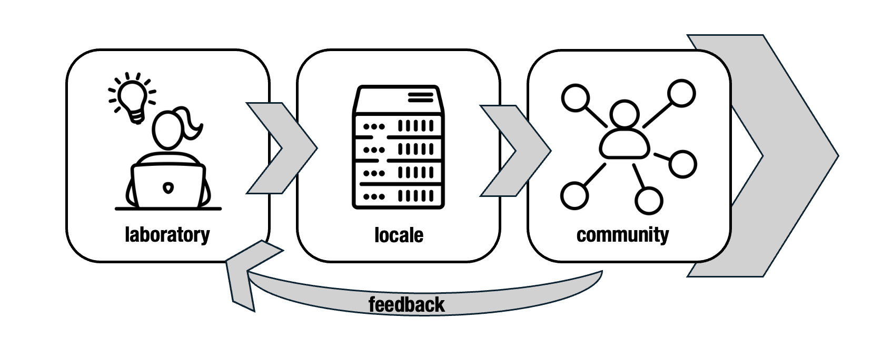

CHTC is a research center at UW - Madison and home to campus computing services. 
Housed across the Computer Science Department and Morgridge Institute for Research, 
we are practitioners of [translational computer science](https://doi.org/10.1109/MC.2019.2925650). CHTC develops technologies 
to advance [high throughput computing](/htc.html), and then deploys those technologies and provides 
computing capacity to a broad community of researchers, with the goal of continuously 
responding to researcher feedback and enabling them to advance their work. Our 
leadership in the [Partnership to Advance Throughput Computing (PATh) Project](https://path-cc.io/) 
represents this commitment to developing tools and communities around them. 

<h2>As a Lab</h2>

CHTC is a laboratory for the development of high throughput 
computing tools and methodologies, including software products like 
the <a href="https://htcondor.org">HTCondor Software Suite</a> and the <a href="https://pelicanplatform.org">Pelican Platform</a>, and championing 
the practice of Research Computing Facilitation. 

<a class="button rounded btn-primary p-2" href="/technologies.html">View Technologies</a>

<h2>As a Service Provider</h2>

As part of our translational computer science mission, CHTC operates computing 
and facilitation services available to UW - Madison affiliates at no cost. 
Any researcher at UW - Madison, who has outgrown their 
current computing capacity (whether that be a laptop, desktop, server, or small cluster) 
can use CHTC's computing capacity to scale up their research. While our speciality 
is in HTC, we can support a wide variety of computing workloads - come talk to us or 
request an account! 

<a class="button rounded btn-primary p-2" href="/uw-research-computing/index.html">View UW Research Computing Overview</a>

<a class="button rounded btn-primary p-2" href="/uw-research-computing/form.html">Request an Account</a>

CHTC also supports the operation of national computing infrastructure like the 
<a href="https://osg-htc.org/services/ospool">Open Science Pool</a> and <a href="https://osg-htc.org/services/osdf">Open Science Data Federation</a>.

<h2>As a Center</h2>

We bring our development activities and our services together under
one roof in order to facilitate the exchange of information between the users and 
developers of our technologies. Without feedback on what researchers need to take 
their work to the next level (or just make computing more accessible), our research 
won't move forward. Our door (or email) is always open to hear about pain points and 
suggestions for improvement. 

<a class="button rounded btn-primary p-2" href="mailto:chtc@cs.wisc.edu">Email us!</a>

<aside class="uw-sidebar">
<button class="uw-button-unstyle uw-side-nav-button"><svg aria-hidden="true" focusable="false"><use xmlns:xlink="http://www.w3.org/1999/xlink" xlink:href="#uw-symbol-caret-down"></use></svg> Select a section…</button>

 
