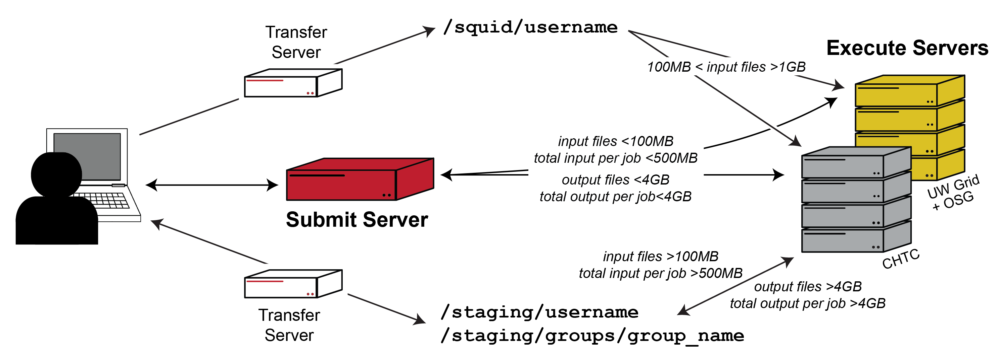
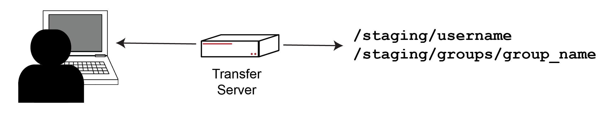
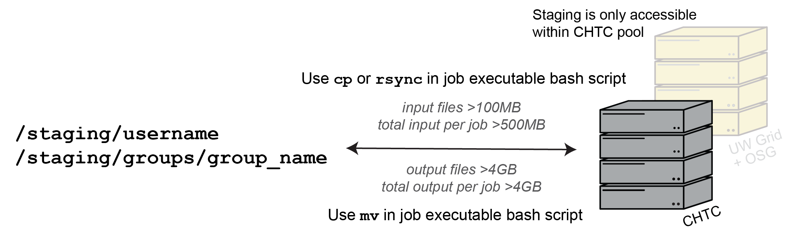

# Data Transfer Solutions By File Size

Due to the distributed nature of CHTC's High Throughput Computing (HTC) system, 
your jobs will run on a server (aka an execute server) that is separate and 
distinct from the server that your jobs are submitted from (aka the submit server). 
This means that a copy of all the files needed to start your jobs must be 
made available on the execute server. Likewise, any output files created 
during the execution of your jobs, which are written to the execute server, 
will also need to be transferred to a location that is accessible to you after your jobs complete. 
**How input files are copied to the execute server and how output files are 
copied back will depend on the size of these files.** This is illustrated via 
the diagram below: 



CHTC's data filesystem called "Staging" is a distinct location for 
temporarily hosting files that are too large to be handled in a 
high-throughput fashion via the default HTCondor file transfer 
mechanism which is otherwise used for small files hosted in your `/home` 
directory on your submit server. 

CHTC's `/staging` location is specifically intended for:

- any individual input files >100MB   
- input files totaling >500MB per job
- individual output files >4GB
- output files totaling >4GB per job 

This guide covers when and how to use `/staging` for jobs run in CHTC. 

# Table of Contents

- [Who Should Use Staging](#use)    
- [Policies and User Responsibilities](#policies-and-user-responsibilities)      
- [Quickstart Instructions](#quickstart-instructions)
- [Get Access To Staging](#access)       
- [Use The Transfer Server To Move Files To/From Staging](#transfer)       
- [Submit Jobs With Input Files in Staging](#input)     
- [Submit Jobs That Transfer Output Files To Staging](#output)
- [Tips For Success When Using Staging](#tips)
- [Managing Staging Data and Quotas](#quota)    

<a name="use"></a>
# Who Should Use `/staging`

`/staging` is a location specifically for hosting singularly larger input (>100MB) 
and/or larger ouput (>4GB) files or when a job needs 500MB or more of total input 
or will produce 4GB or more of total output. Job input and outupt of these 
sizes are too large to be managed by CHTC's other data movement methods. 

**Default CHTC account creation does not include access to `/staging`.** 
Access to `/staging` is provided as needed for supporting your data management 
needs. If you think you need access to `/staging`, or would 
like to know more about managing your data needs, please contact us at 
<chtc@cs.wisc.edu>.

Files hosted in `/staging` are only excessible to jobs running in the CHTC pool. 
About 50% of CHTC execute servers have access to `/staging`. Users will get 
better job throughput if they are able to break up their work into smaller jobs 
that each use or produce input and output files that do not require `/staging`.

# Policies and User Responsibilities

**USERS VIOLATING ANY OF THE POLICIES IN THIS GUIDE WILL
HAVE THEIR DATA STAGING ACCESS AND/OR CHTC ACCOUNT REVOKED UNTIL CORRECTIVE
MEASURES ARE TAKEN. CHTC STAFF RESERVE THE RIGHT TO REMOVE ANY
PROBLEMATIC USER DATA AT ANY TIME IN ORDER TO PRESERVE PERFORMANCE**

<p style="background-color:yellow;"> Jobs should <b>NEVER</b> be submitted from 
<code>/staging</code>. All HTCondor job submissions must be performed from your 
<code>/home</code> directory on the submit server and job <code>log</code>, 
<code>error</code>, and <code>output</code> files should never be 
written to <code>/staging</code>.</p>

- **Backup your files**: As with all CHTC file spaces, CHTC does not back 
up your files in `/staging`.

- **Use bash script commands to access files in `/staging`**: Files placed in `/staging` 
should **NEVER** be listed in the submit file, but rather accessed 
via the job's executable (aka .sh) script. More details provided 
in [Submit Jobs With Input Files in Staging](#input)
and [Submit Jobs That Transfer Output Files To Staging](#output).

- **Use the transfer server**: We expect that users will only use our dedicated 
transfer server, transfer.chtc.wisc.edu, instead of the submit server,
to upload and download appropriate files to and from `/staging`. Transferring 
files to `/staging` with the submit server can negatively impact job submission for 
you and other users. For more details, please see 
[Use The Transfer Server To Move Files To/From Staging](#transfer)

- **Quota control**:`/staging` directories include disk space and 
items (i.e. directories and files) quotas. Quotas are necessary for 
maintaning the stability and reliability of `/staging`. Quota changes can 
be requested by emailing <chtc@cs.wisc.edu> and 
users can monitor quota settings and usage as described in 
[Managing Staging Data and Quotas](#quota)

- **Reduce file size and count**: We expect that users will use `tar` and 
compression to reduce data size and file counts such that a single tarball 
is needed and/or produced per job. More details provided in [Submit Jobs With Input Files in Staging](#input)
and [Submit Jobs That Transfer Output Files To Staging](#output).

- **Shared group data**: `/staging` directories are owned by the user, 
and only the user's own jobs can access these files. We can create shared group 
`/staging` directories for sharing larger input and output files as needed. 
[Contact us](mailto:chtc@cs.wisc.edu) to learn more.

- **Remove data**: We expect that users will remove data from `/staging` as
soon as it is no longer needed for actively-running jobs. 

- CHTC staff reserve the right to remove data from `/staging` 
(or any CHTC file system) at any time.

# Quickstart Instructions

1. Request access to `/staging`.   

   * For more details, see [Get Access To Staging](#access)       

1. Review `/staging` [Policies and User Responsibilities](#policies-and-user-responsibilities)

1. Prepare input files for hosting in `/staging`.    
   
   * Compress files to reduce file size and speed up 
file transfer.

   * If your jobs need multiple large input files, 
use `tar` and `zip` to combine files so that only a single `tar` or `zip` 
archive is needed per job.

1. Use the transfer server, `transfer.chtc.wisc.edu`, to upload input 
files to your `/staging` directory.

   * For more details, see [Use The Transfer Server To Move Files To/From Staging](#transfer).
   
   * For details, see [Submit Jobs With Input Files in Staging](#input).

1. Create your HTCondor submit file.       

   * Include the following submit detail to ensure that
your jobs will have access to your files in `/staging`:

   ``` {.sub}
   requirements = (HasCHTCStaging =?= true)
   ```
     
1. Create your executable bash script.     

   * Use `cp` or `rsync` to copy large input 
from `/staging` that is needed for the job. For example:

   ```
   cp /staging/username/my-large-input.tar.gz ./
   tar -xzf my-large-input.tar.gz
   ```
   {:.file}

   * If the job will produce output >4GB this output should be 
be compressed  moved to `/staging` before job terminates. If multiple large output 
files are created, use `tar` and `zip` to reduce file counts. For 
example:

   ```
   tar -czf large_output.tar.gz output-file-1 output-file-2 output_dir/
   mv large_output.tar.gz /staging/username
   ```
   {:.file}

   * Before the job completes, delete input copied from `/staging`, the 
extracted large input file(s), and the uncompressed or untarred large output files. For example:

   ```
   rm my-large-input.tar.gz
   rm my-large-input-file
   rm output-file-1 output-file-2
   ```
   {:.file}

   * For more details about job submission using input from `/staging` or for hosting 
output in `/staging`, please see [Submit Jobs With Input Files in Staging](#input) and 
[Submit Jobs That Transfer Output Files To Staging](#output).

1. Remove large input and output files `/staging` after jobs complete using 
`transfer.chtc.wisc.edu`.

<a name="access"></a>

# Get Access To `/staging`

<details><summary>Click to learn more</summary>
<p>

CHTC accounts do not automatically include access to `/staging`. If you think 
you need a `/staging` directory, please contact us at <chtc@cs.wisc.edu>. So 
we can process your request more quickly, please include details regarding 
the number and size of the input and/or output files you plan to host in 
`/staging`. You will also be granted access to out dedicated transfer 
server upon creation of your `/staging` directory. 

*What is the path to my `/staging` directory?*
- Individual directories will be created at `/staging/username`
- Group directories will be created at `/staging/groups/group_name`

*How much space will I have?*

Your quota will be set based on your specific data needs. To see more 
information about checking your quota and usage in staging, see the 
end of this guide: [Managing Staging Data and Quotas](#quota)

[Return to top of page](#data-transfer-solutions-by-file-size)

</p>
</details>

<a name="transfer"></a>
# Use The Transfer Server To Move Files To/From `/staging`

<details><summary>Click to learn more</summary>
<p>



Our dedicated transfer server, `transfer.chtc.wisc.edu`, should be used to 
upload and/or download your files to/from `/staging`.

The transfer server is a separate server that is independent of the submit 
server you otherwise use for job submission. By using the transfer server 
for `/staging` data upload and download, you are helping to reduce network 
bottlenecks on the submit server that could otherwise negatively impact 
the submit server's performance and ability to manage and submit jobs. 

**Users should not use their submit server to upload or download files 
to/from `staging` unless otherwise directed by CHTC staff.**

*How do I connect to the transfer server?*    
Users can access the transfer server the same way they access their 
submit server (i.e. via Terminal app or PuTTY) using the following 
hostname: `transfer.chtc.wisc.edu`.

*How do I upload/download files to/from `staging`?*    
Several options exist for moving data to/from `staging` including:

- `scp` and `rsync` can be used from the terminal to move data 
to/from your own computer or *another server*. For example:

	```
	$ scp large.file username@transfer.chtc.wisc.edu:/staging/username/
	$ scp username@serverhostname:/path/to/large.file username@transfer.chtc.wisc.edu:/staging/username/ 
	```
	{:.term}

	**Be sure to use the username assigned to you on the other submit server for the first 
	argument in the above example for uploading a large file from another server.**

- GUI-based file transfer clients like WinSCP, FileZilla, and Cyberduck 
can be used to move files to/from your personal computer. Be 
sure to use `transfer.chtc.wisc.edu` when setting up the connection.

- Globus file transfer can be used to transfer files to/from a Globus Endpoint. 
See our guide [Using Globus To Transfer Files To and From CHTC](globus.shtml) 
for more details.

- `smbclient` is available for managing file transfers to/from file 
servers that have `smbclient` installed, like DoIT's ResearchDrive. See our guide 
[Transferring Files Between CHTC and ResearchDrive](transfer-data-researchdrive.shtml) 
for more details.

[Return to top of page](#data-transfer-solutions-by-file-size)

</p>
</details>

<a name="input"></a>
# Submit Jobs With Input Files in `/staging`

<details><summary>Click to learn more</summary>
<p>



`/staging` is a distinct location for temporarily hosting your 
individually larger input files >100MB in size or in cases when jobs 
will need >500MB of total input. First, a copy of 
the appropriate input files must be uploaded to your `/staging` directory 
before your jobs can be submitted. As a reminder, individual input files <100MB 
in size should be hosted in your `/home` directory.

Both your submit file and bash script 
must include the necessary information to ensure successful completion of 
jobs that will use input files from `/staging`. The sections below will 
provide details for the following steps: 

1. Prepare your input before uploading to `/staging` 
2. Prepare your submit files for jobs that will use large input 
files hosted in `/staging`
3. Prepare your executable bash script to access and use large input 
files hosted in `/staging`, delete large input from job

## Prepare Large Input Files For `\staging`

**Organize and prepare your large input such that each job will use a single, 
or as few as possible, large input files.** 

As described in our policies, data placed in `/staging` should be 
stored in as few files as possible. Before uploading input files 
to `/staging`, use file compression (`zip`, `gzip`, `bzip`) and `tar` to reduce 
file sizes and total file counts such that only a single, or as few as 
possible, input file(s) will be needed per job.

If your large input will be uploaded from your personal computer 
Mac and Linux users can create input tarballs by using the command `tar -czf` 
within the Terminal. Windows users may also use a terminal if installed, 
else several GUI-based `tar` applications are available, or ZIP can be used 
in place of `tar`.

The following examples demonstrate how to make a compressed tarball 
from the terminal for two large input files named `file1.lrg` and 
`file2.lrg` which will be used for a single job:

```
my-computer username$ tar -czf large_input.tar.gz file1.lrg file2.lrg
my-computer username$ ls
file1.lrg
file2.lrg
large_input.tar.gz
```
{: .term}

Alternatively, files can first be moved to a directory which can then 
be compressed:

```
my-computer username$ mkdir large_input
my-computer username$ mv file1.lrg file2.lrg large_input/
my-computer username$ tar -czf large_input.tar.gz large_input
my-computer username$ ls -F
large_input/
large_input.tar.gz
```
{: .term}

After preparing your input, 
use the transfer server to upload the tarballs to `/staging`. Instructions for 
using the transfer server are provide in the above section 
[Use The Transfer Server To Move Large Files To/From Staging](#transfer).

## Prepare Submit File For Jobs With Input in `/staging`

Not all CHTC execute servers have access to `/staging`. If your job needs access 
to files in `/staging`, you must tell HTCondor to run your jobs on the approprite servers 
via the `requirements` submit file attribute. **Be sure to request sufficient disk 
space for your jobs in order to accomodate all job input and output files.**

An example submit file for submitting a job that requires access to `/staging` 
and which will transfer a smaller, <100MB, input file from `/home`:

```{.sub}
# job with files in staging and input in home example

log = my_job.$(Cluster).$(Process).log
error = my_job.$(Cluster).$(Process).err
output = my_job.$(Cluster).$(Process).out

...other submit file details...

# transfer small files from home
transfer_input_files = my_smaller_file

requirements = (HasCHTCStaging =?= true)

queue
```

**Remember:** If your job has any other requirments defined in 
the submit file, you should combine them into a single `requirements` statement:

```{.sub}
requirements = (HasCHTCStaging =?= true) && other requirements
```

## Use Job Bash Script To Access Input In `/staging`

Unlike smaller, <100MB, files that are transferred from your home directory 
using `transfer_input_files`, files placed in `/staging` should **NEVER** 
be listed in the submit file. Instead, you must include additional 
commands in the job's executable bash script that will copy (via `cp` or `rsync`) 
your input in `/staging` to the job's working directory and extract ("untar") and 
uncompress the data.

**Additional commands should be included in your bash script to remove 
any input files copied from `/staging` before the job terminates.** 
HTCondor will think the files copied from `/staging` are newly generated 
output files and thus, HTCondor will likely transfer these files back 
to your home directory with other, real output. This can cause your `/home` 
directory to quickly exceed its disk quota causing your jobs to 
go on hold with all progress lost.

Continuing our example, a bash script to copy and extract 
`large_input.tar.gz` from `/staging`:

```	
#!/bin/bash
	
# copy tarball from staging to current working dir
cp /staging/username/large_input.tar.gz ./

# extract tarball
tar -xzf large_input.tar.gz

...additional commands to be executed by job...

# delete large input to prevent
# HTCondor from transferring back to submit server
rm large_input.tar.gz file1.lrg file2.lrg

# END
```
{:.file}

As shown in the exmaple above, \*both\* the original tarball, `large_input.tar.gz`, and 
the extracted files are deleted as a final step in the script. If untarring 
`large_input.tar.gz` insteads creates a new subdirectory, then only the original tarball 
needs to be deleted.

<details><summary><em>Want to speed up jobs with larger input data?</em></summary>
<p>

If your your job will transfer >20GB worth of input file, then using `rm` to remove these 
files before the job terminates can take a while to complete which will add 
unnecessary runtime to your job. In this case, you can create a 
subdirectory and move (`mv`) the large input to it - this will complete almost 
instantaneously. Because these files will be in a subdirectory, HTCondor will 
ignore them when determining with output files to transfer back to the submit server.

For example:

```
# prevent HTCondor from transferring input file(s) back to submit server
mkdir ignore/
mv large_input.tar.gz file1.lrg file2.lrg ignore/
```
{:.file}

</p>
</details>

## Remove Files From `/staging` After Jobs Complete

Files in `/staging` are not backed up and `/staging` should not 
be used as a general purpose file storage service. As with all 
CHTC file spaces, data should be removed from `/staging` as
soon as it is no longer needed for actively-running jobs. Even if it
will be used in the future, your data should be deleted and copied
back at a later date. Files can be taken off of `/staging` using similar 
mechanisms as uploaded files (as above). 

[Return to top of page](#data-transfer-solutions-by-file-size)

</p>
</details>

<a name="output"></a>
# Submit Jobs That Transfer Output Files To `/staging`

<details><summary>Click to learn more</summary>
<p>


`/staging` is a distinct location for temporarily hosting 
individual output files >4GB in size or in cases when >4GB 
of output is produced by a single job. 

Both your submit file and job bash script 
must include the necessary information to ensure successful completion of 
jobs that will host output in `/staging`. The sections below will 
provide details for the following steps: 

1. Prepare your submit files for jobs that will host output in `/staging`
2. Prepare your executable bash script to tar output and move to `/staging`

## Prepare Submit File For Jobs That Will Host Output In `/staging`

Not all CHTC execute servers have access to `/staging`. If your 
will host output files in `/staging`, you must tell HTCondor to run 
your jobs on the approprite servers via the `requirements` submit 
file attribute:

```{.sub}
# job that needs access to staging

log = my_job.$(Cluster).$(Process).log
error = my_job.$(Cluster).$(Process).err
output = my_job.$(Cluster).$(Process).out

...other submit file details...

requirements = (HasCHTCStaging =?= true)

queue
```

**Remember:** If your job has any other requirments defined in 
the submit file, you should combine them into a single `requirements` statement:

```{.sub}
requirements = (HasCHTCStaging =?= true) && other requirements
```

## Use Job Bash Script To Move Output To `/staging`

Output generated by your job is written to the execute server 
where the run jobs. For output that is large enough (>4GB) to warrant use 
of `/staging`, you must include steps in the executable bash script of 
your job that will package the output into a tarball and relocate it 
to your `/staging` directory before the job completes. **This can be 
acheived with a single `tar` command that directly writes the tarball 
to your staging directory!** It is IMPORTANT that no other files be written 
directly to your `/staging` directory during job execution except for 
the below `tar` example.

For example, if a job writes a larger ammount of output to 
a subdirectory `output_dir/` along with an additional 
larger output file `output.lrg`, the following steps will 
package the all of the output into a single tarball that is 
then moved to `/staging`. **Note:** `output.lrg` will still exist 
in the job's working directory after creating the tarball and thus 
must be deleted before job completes.

```
#!/bin/bash
 
# Commands to execute job

...

# create tarball located in staging containing >4GB output
tar -czf /staging/username/large_output.tar.gz output_dir/ output.lrg

# delete an remaining large files 
rm output.lrg

# END
```
{: .file}

If a job generates a single large file that will not shrink much when 
compressed, it can be moved directly to staging. If a job generates 
multiple files in a directory, or files can be substantially made smaller 
by zipping them, the above example should be followed. 

```
#!/bin/bash
 
# Commands to execute job

...

# move single large output file to staging
mv output.lrg /staging/username/

# END
```
{: .file}

## Managing Larger `stdout` From Jobs

Does your software produce a large amount of output that gets 
saved to the HTCondor `output` file? Some software are written to 
"stream" output directly to the terminal screen during interactive execution, but 
when the software is executed non-interactively via HTCondor, the output is 
instead saved in the `output` file designated in the HTCondor submit file.

Because HTCondor will transfer `output` back to your home directory, if your 
jobs produce HTCondor `output` files >4GB it is important to move this 
data to `/staging` by redirecting the output of your job commands to a 
separate file that gets packaged into a compressed tarball and relocated 
to `/staging`: 

```
#!/bin/bash

# redirect standard output to a file in the working directory
./myprogram myinput.txt > large.stdout

# create tarball located in staging containing >4GB output
tar -czf /staging/username/large.stdout.tar.gz large.stdout

# delete large.stdout file
rm large.stdout

# END
```
{: .file}

[Return to top of page](#data-transfer-solutions-by-file-size)

</p>
</details>

<a name="tips"></a>
# Tips For Success When Using `/staging`

In order to properly submit jobs use `/staging` for managing larger 
input and output file, always do the following:

- **Submit from `/home`**: ONLY submit jobs from within your home directory
    (`/home/username`), and NEVER from within `/staging`.

- **No large data in the submit file**:  Do NOT list any files from `/staging` in 
your submit file and do NOT use `/staging` as a path for any submit file attributes 
such as `executable, log, output, error, transfer_input_files`. 
As described in this guide, all interaction with `/staging` will occur via 
command in the executable bash script. 

- **Request sufficient disk space**: Using `request_disk`, request an amount of disk 
space that reflects the total of a) input data that each job will copy into
the job working directory from `/staging` including the size of the tarball and the 
extracted files b) any input transferred via `transfer_input_files`, 
and c) any output that will be created in the job working directory.

- **Require access to `/staging`**: Tell HTCondor that your jobs need to run on 
execute servers that can access `/staging` using the following submit file attribute:
	
	```{.sub}
	Requirements = (Target.HasCHTCStaging == true)
	```

[Return to top of page](#data-transfer-solutions-by-file-size)

<a name="quota"></a>
# Managing `/staging` Data and Quotas

Use the command `get_quotas` to see what disk 
and items quotas are currently set for a given directory path. 
This command will also let you see how much disk is in use and how many 
items are present in a directory:

```
[username@transfer ~]$ get_quotas /staging/username
```
{:.term}

[Return to top of page](#data-transfer-solutions-by-file-size)
