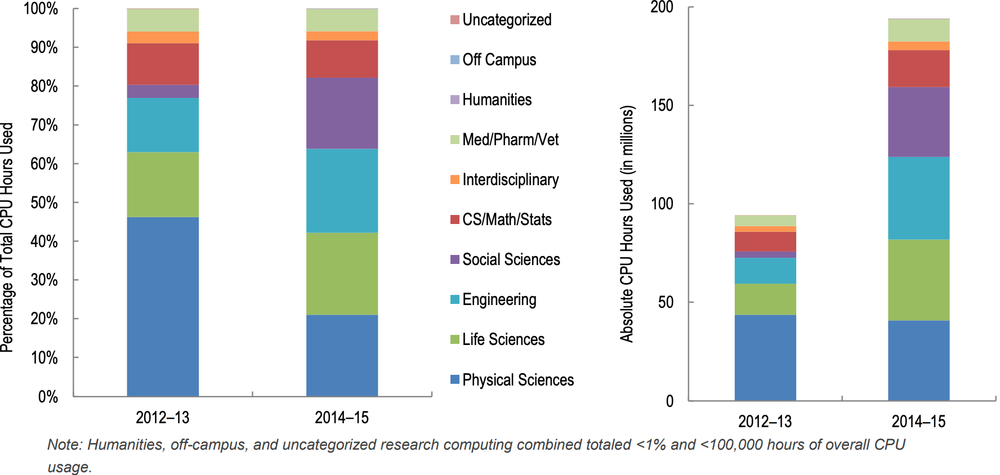

RC facilitators serve as proactive and personalized guides, helping researchers
identify and implement computational approaches that result in the greatest impact to their projects. Rather
than possessing a significant depth of expertise in computational technologies, RC facilitators build and
leverage their team of expert technical staff and translate the details of computational options for individual
researchers. Through this two-way relationship-building approach, dedicated RC facilitators have enabled
previously unimagined and significant scholarship outcomes of scale and scope across a variety of research
domains, especially within the space of campus-supported research computing centers.

## Impact

Since the hiring of the first Research Computing Facilitator in 2013 usage of computing services by previously underserved researchers
increased significantlyy (see figure below).  Importantly, more than 95% of usage from the life sciences and
social sciences has been on an HTC-optimized compute configuration rather than a traditional HPC
cluster, emphasizing the applicability of multiple compute configurations to meet needs across domains.

## Goals

The following outlines the primary goals (the needs) of successful RC facilitation and identifies the related
major activities for achieving those goals.

* Proactive Engagement
* Personalized Guidance
* Teaching Researchers to Fish
* Building Relationships
* Advocating for Research Needs
* Developing Connections among Staff

## Skills and Backgrounds

Three key areas of experience and interest are relevant for successful RC facilitators: individual interests
and motivation, communication and interpersonal skills, and technical knowledge.

__Interests and Motivation__

* A desire to enable and support the scholarly work of others
* Interest in a wide set of research domains beyond their own area of expertise
* The ability and the desire to work in a team environment
* A desire to further develop the skills and interests relevant to effective facilitation

__Communication and Interpersonal Skills__

* Excellent written and verbal communication, including active and empathetic listening skills and an
  ability to translate complex and domain-specific information for nonspecialists
* Demonstrated effectiveness and comfort in teaching and public speaking
* Success and demonstrated interest in interpersonal networking and liaising
* The desire to work in a team environment, where staff frequently depend on one another
* Leadership skills that inspire action and coordinate the activities of shared contributions

__Technical Abilities__

* Prior experience conducting research projects or other significant scholarly work with some
  integration of relevant computational systems and tools
* A demonstrated ability to understand multiple aspects of a problem and identify appropriate solutions
* The ability to provide solution-agnostic support by focusing on research requirements and desired
  outcomes
* A desire for continuous learning of relevant technology topics

## More information

More information on Research Facilitators can be in the paper 
["Research Computing Facilitators: The Missing Human Link in Needs-Based Research Cyberinfrastructure"](https://library.educause.edu/-/media/files/library/2016/5/erb1602.pdf)
co-written by CHTC's own Lauren Micheal.
