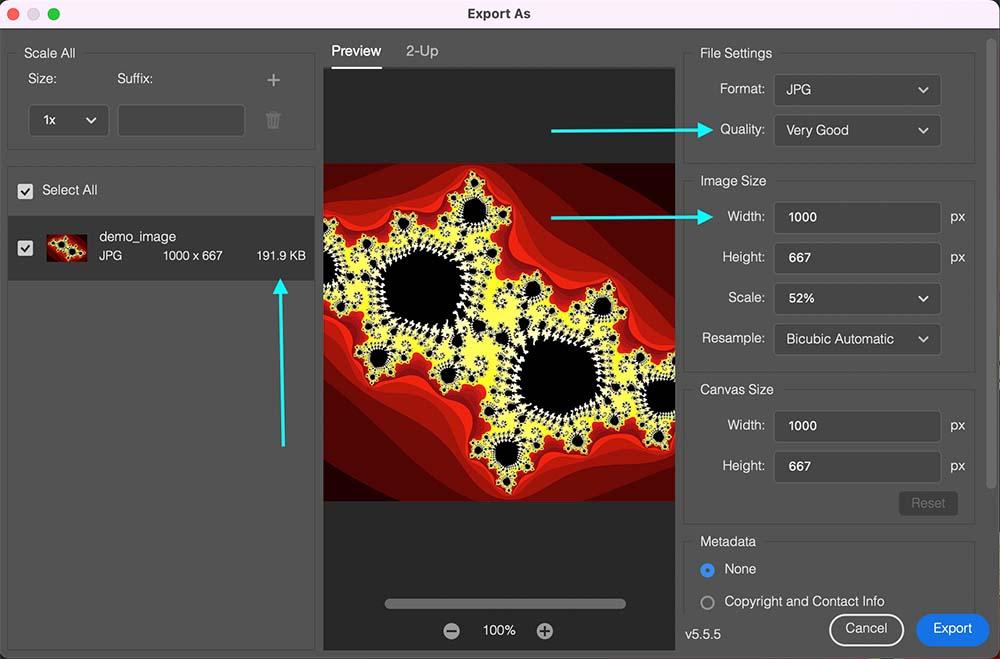

Table of Contents
- [Using Markdown](#using-markdown)
- [Adding Articles](#adding-article-to-the-website)
- [Using Images](#using-images)
    - [Adding Images](#adding-images)
    - [Reducing Image Size](#reducing-image-size)
    - [Positioning Images](#positioning-images)

### Using Markdown

You will be using Markdown to write all news articles. Markdown is a popular markup
language that is converted to HTML before being displayed on the website.

A good cheatsheet can be found [here](https://github.com/adam-p/markdown-here/wiki/Markdown-Cheatsheet) which contains
the markdown syntax and examples of how it looks when converted to html.

### Adding Article To the Website

After you have written your article in the text editor of your choice and are ready to have it on the website you will first need to create a preview branch.

All of our websites have a preview location where you can view changes before adding them to the main website. I will use PATh for the example below, but this is the same process for CHTC, HTCondor and OSG as well.

| Project  | Github Repo                                                                                                                  | Preview URL Prefix                                                                   |
|----------|------------------------------------------------------------------------------------------------------------------------------|--------------------------------------------------------------------------------------|
| CHTC     | [https://github.com/CHTC/chtc-website-source](https://github.com/CHTC/chtc-website-source)                                   | [https://chtc.github.io/web-preview/](https://chtc.github.io/web-preview/)           |
| HTCondor | [https://github.com/htcondor/htcondor-web](https://github.com/htcondor/htcondor-web)                                         | [https://htcondor.com/web-preview/](https://htcondor.com/web-preview/)               |
| OSG      | [https://github.com/opensciencegrid/opensciencegrid.github.io](https://github.com/opensciencegrid/opensciencegrid.github.io) | [https://opensciencegrid.org/web-preview/](https://opensciencegrid.org/web-preview/) |
| PATh     | [https://github.com/path-cc/path-cc.github.io](https://github.com/path-cc/path-cc.github.io)                                 | [https://path-cc.io/web-preview/](https://path-cc.io/web-preview/)                   |

1. Go to the Github repo and Create a preview branch
    - Branch name must start with 'preview-' followed by a descriptive term.
        - Example: You write an article about HTC and Genes, you name the branch 'preview-gene-article'.
    - 

2. Add your News article
    1. Check that are in your new branch
        - The previous step will put you in your new preview branch. You can check by looking at the branch name displayed.
    2. Go into the news article directory
    3. Add new file with title 'YYYY-MM-DD-title.md'
        - Example: For the HTC and Genes article -> '2021-12-25-htc-and-genes.md' if you are going to publish the article on Christmas 2021.
    4. Copy and Paste in the template
         ```
         ---
         title:                          # Article Title
         date: 9999-12-31                # Article Date - In format YYYY-MM-DD - Article will not show on website until Article Data >= Current Date
         excerpt:                        # Article Excerpt - An abstract of the article
         image_src:                      # Path to the image to be displayed in article cards
         image_alt:                      # A description of this image
         author:                         # Article Author
         published: false                # If this article should be on the website, change to true when ready to publish
         --- 
         
         Content
         ```
    5. Fill in all the front matter and replace 'Content' with your article.
       

3. Review your Preview
    - Look for your article preview at <Project Preview URL Prefix><branch-name>
    - Example for PATh: https://path-cc.io/web-preview/preview-helloworld
        - Project Preview URL Prefix: https://path-cc.io/web-preview/
        - Branch Name: preview-helloworld
          

4. Create a Pull Request
    - When the article is ready to go live you must create a pull request from your branch into 'master'.
    - Comment the preview URL in the Pull Request for easy review.
      

### Using Images

### Adding Images

Images can be added using either MD or HTML.

1. Markdown
    - To add an image in Markdown your user the syntax `````` excluding the single quotes.
    - You can add classes to adjust how the image appears by using ```{: .<class-name> }``` above.
        - All classes that can be used can be found [here](https://getbootstrap.com/docs/5.0/utilities/api/), but the ones you are most likely to use are [float](https://getbootstrap.com/docs/5.0/utilities/float/), and [image](https://getbootstrap.com/docs/5.0/content/images/) classes.
    - Example: The below markdown shows the demo image with the class ```float-right``` which positions the image to the right of the text.
        ```markdown
            {: .float-right }
            
        ```

2. HTML
    - Images added with html will use the '[img]((https://www.w3schools.com/tags/tag_img.asp))' tag.
    - The syntax for this is:
        ```
            
               
                <figcaption>The image caption</figcaption>
            </figure>
        ``` 


### Reducing Image Size

High definition images can take up space that slows down the website when it loads, because of this it is important to reduce this footprint before adding them to the website.

To keep the image size reasonable follow the rules below.

- <= 1000 pixels wide
    - This is the maximum website width, so any images wider will have unused resolution.
- Convert to jpg and reduce to reasonable size
    - This is up to you and changes picture to picture. Some pictures look fine when compressed, some don't.
    - Reasonable target is ~200kb

#### Example


We will reduce this 2MB image to demonstrate.

1. Pull up the image in photoshop. If you don't have photoshop contact IT as you do have free access.

2. Go to Export as...
   

3. Update the Values to reduce size.
   

4. Use your new compressed image in the article.
   

### Positioning Images

To position images on the page you must use classes.
For markdown this means including ```[: .<class> }``` above the image syntax, and
for html this means adding ```class="<class>"``` inside the html tag.

Potential classes that can be used to position the image come from [Bootstrap Utilities](https://getbootstrap.com/docs/5.0/utilities/api/).

The ones you will find the most helpful are:
1. [Floats](https://getbootstrap.com/docs/5.0/utilities/float/")
2. [Image Specific](https://getbootstrap.com/docs/5.0/content/images/)

