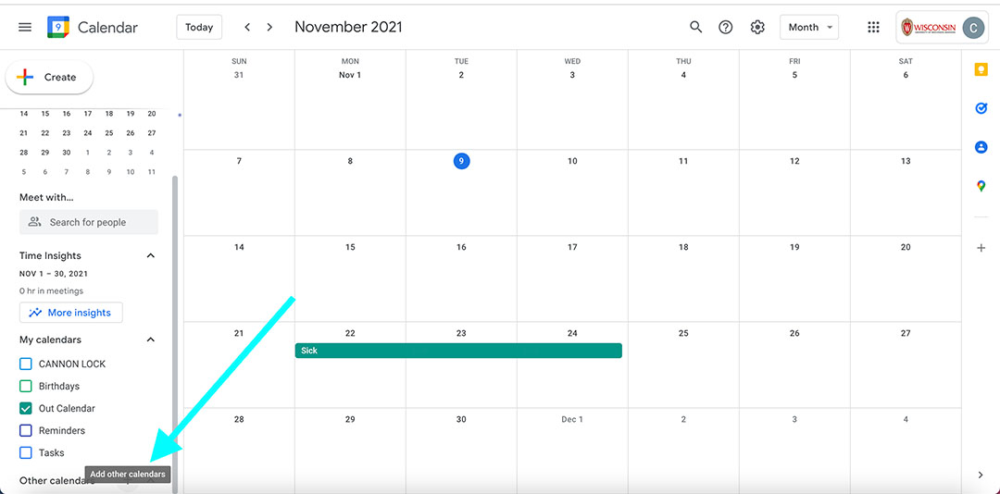
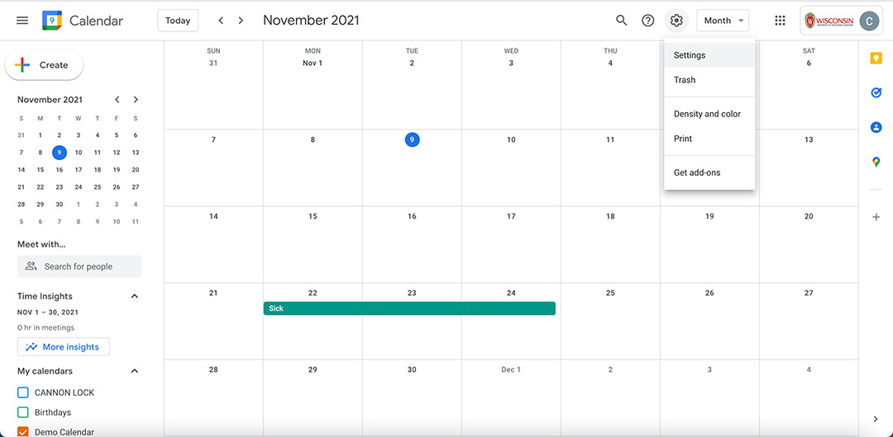
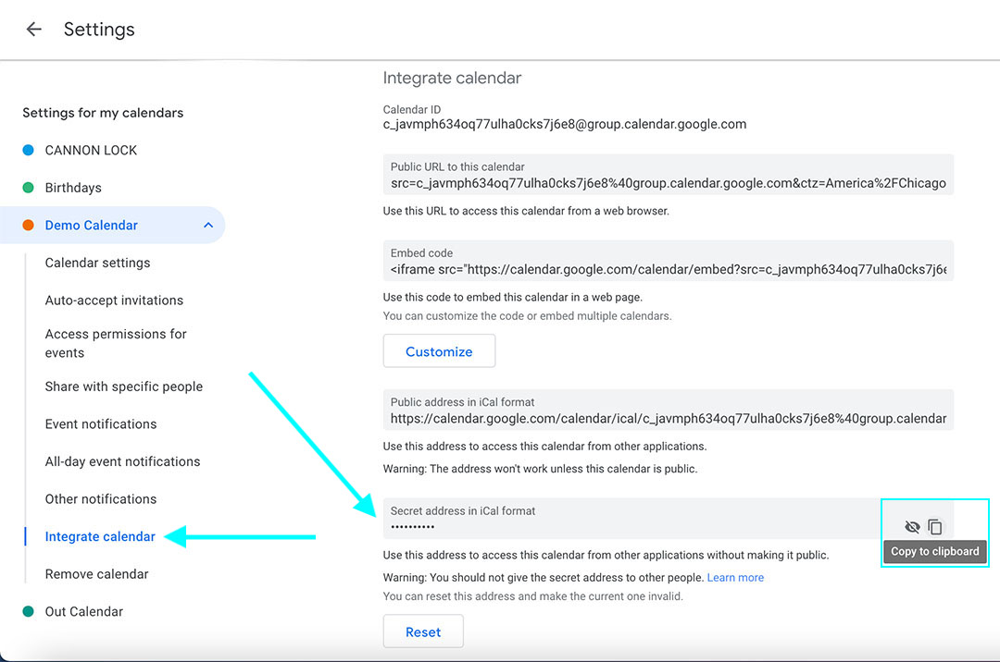
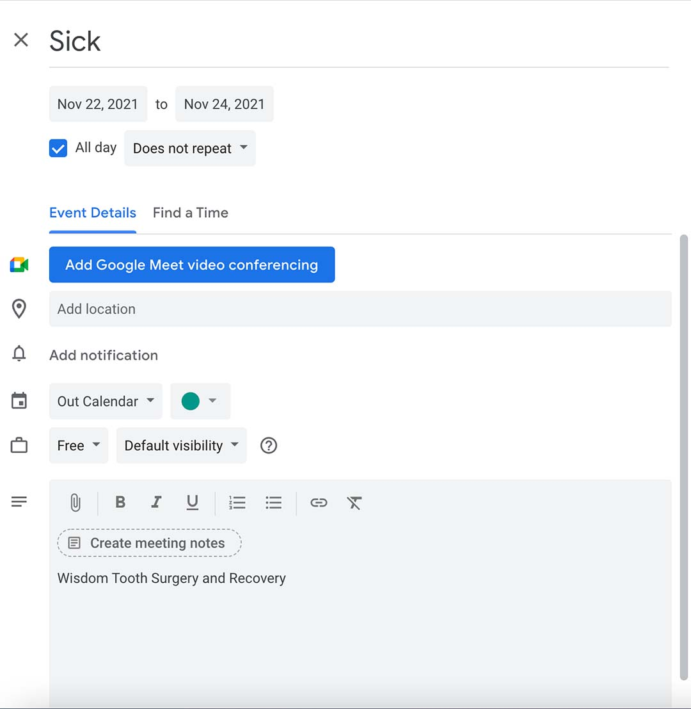
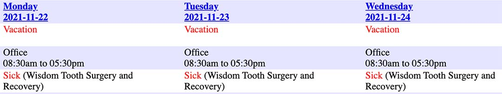

- [Creating The Schedule File](#creating-the-schedule-file)
- [Populating Your Days Off](#populating-your-days-off)

### Creating The Schedule File

This section will describe how to create your yaml file, you can find a verbose template file on [afs](https://research.cs.wisc.edu/htcondor/developers/schedules/sample_yaml_schedule.html) or use the one below.

*\<shortname>.yml*
```
Name: "<name>"
ShortName: "<shortname>"
corehours: "<corehours>"
DailyEmail: "Yes" # ( or omit line entirely )
Email: “<email>”
Office: “<location>”
Phone: “<phone>” # Office and/or Cell - This is read as a string so format how you want
calendarurl: "<calendarurl>"
default:
  starttime: "<starttime>"
  endtime: "<endtime>"
  status: "<status>"
```
##### File Details

*Name*: First Last

*ShortName*: Your file name, should be unique and obviously you. Good choice for George Washington would be "gwashington".

*corehours*: A description of your corehours that is displayed. Format is not important. Example is "9:00 AM to 5:00 PM"

*DailyEmail*: If ‘Yes’ the you receive a daily email with who is out, otherwise should be omitted entirely.

*Email*: Your preferred email address. Defaults to filename@cs.wisc.edu so you will likely want to change this

*Office*: Your office location. Example => “4261 CS”

*Phone*: Your phone number(s). Example => “+1 608 265 5736 (office) <br> +1 608 576 0351 (cell)”

*calendarurl*: The url to your outage calendar. Details on obtaining this found [below](#creating-your-ical-url).

*starttime*: Your typical start time, use military format. Example => "09:00"

*endtime*: Your typical end time, use military format. Example => "17:00"

*status*: Your status during these hours. If you are unsure use "Office".

_Important_

All of these data strings have to be encased in double quotations to be valid yaml. This encasement can be seen in the template file.

#### Creating Your ICAL URL

To power your outage calendar you need to create a google calendar which is solely used to populate your outages.

1. Go to [https://calendar.google.com/](https://calendar.google.com/) and sign in with your preferred account. You can use @morgridge.org and @wisc.edu.
2. Create a new calendar
    - Name and Description do not matter
    - 

3. Go into Calendar settings and retrieve the Secret Address
    - Go to calendar Settings
      
    - Get the secret calendar url ( Will warn not to give this out )  
      

4. Post this address into your yaml file as the calendarurl

### Populating Your Days Off

All events that you add to your google calendar are echoed into the CHTC Schedule Application. All events in the Schedule application have four components.

- Start
- End
- Status
- Description

Which are translated from google calendar events attributes respectively.

- Start
- End
- Title
- Description

When converting your google calendar to the CHTC schedule format Start, End, and Description will stay the same. The Google event Title will be the Status. Valid Statuses are listed below.

- Travel:   Working, but not at the office. Perhaps a conference
- Vacation: Taking vacation ("vacation" and "personal holiday" on the leave report)
- Sick:     Taking sick leave ("sick leave" on the leave report)
- Holiday:  Taking floating holiday ("legal holiday" on the leave report)
- Furlough: State- or UW-mandated furlough (as required). Includes both fixed ("mandatory") and floating time.
- Off:      Days not worked on a part-time employment

For Instance if you mark your title in Google as "Sick" and the description as "Wisdom Tooth Surgery and Recovery" the schedule output will be as so.






##### Marking Full day/days Out

To mark full day outages you create an event with the "All day" attribute ticked ( This is used in the demo above ). Populate the title and description as expected.

##### Marking Partial Outages

To mark partial time you must do two different things.

1. Append the amount of hours this outage is taking with a colon separating the title.
    - For Example, if you have a two hour doctor appt. you would mark SICK:2
    - For Example, if you leave for vacation half a day early you would mark VACATION:4

2. Mark the time you are _*in*_ the office on Google
    - This is non-intuitive but when you are marking time you mark the time you are in.
    - For Example, if I am normally in 9-5 and am leaving 4 hours early I will mark my event to go from 9:00 AM to 1:00 PM.